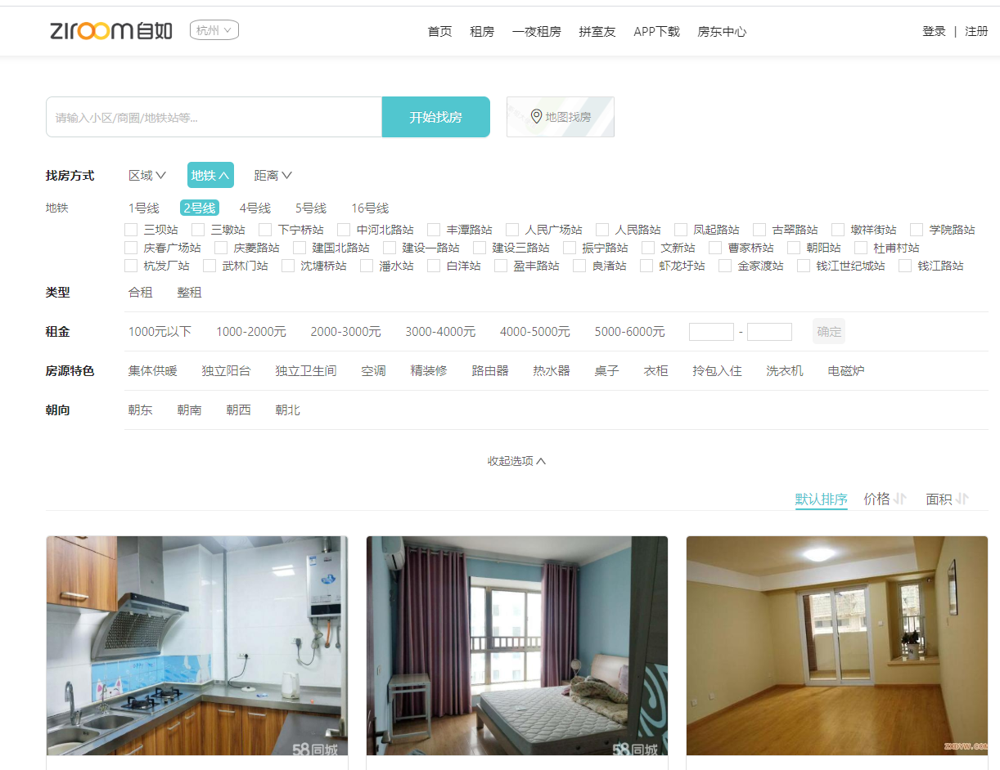
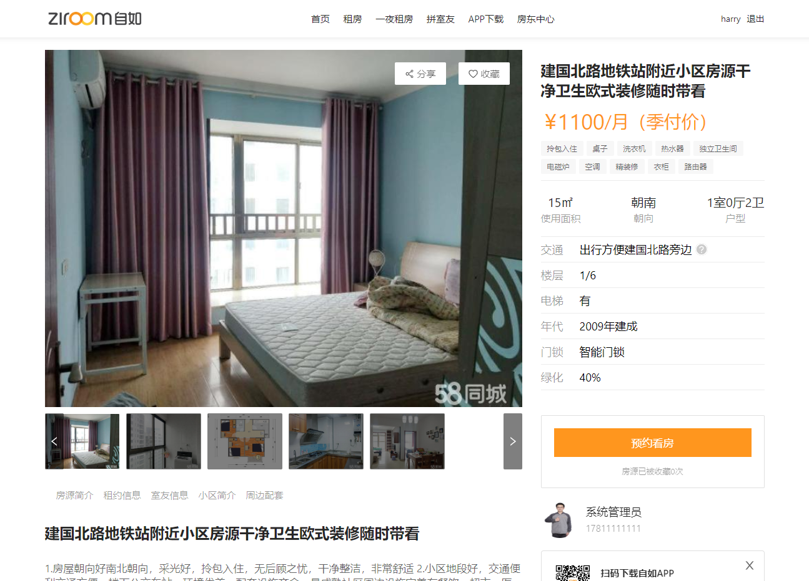
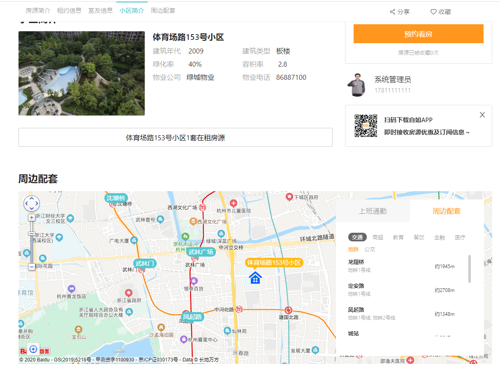
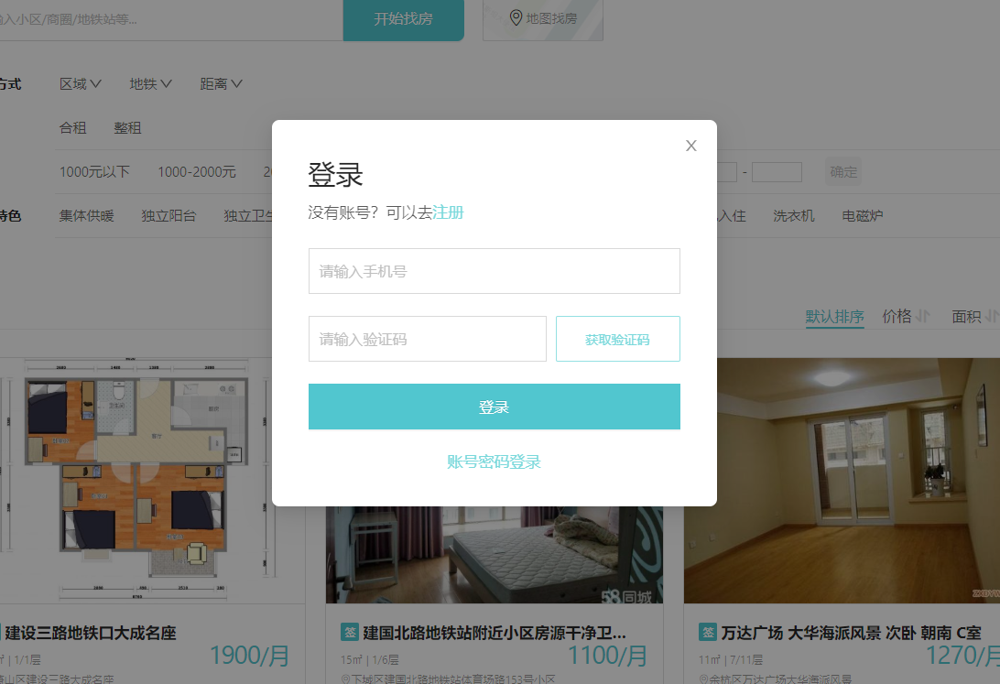
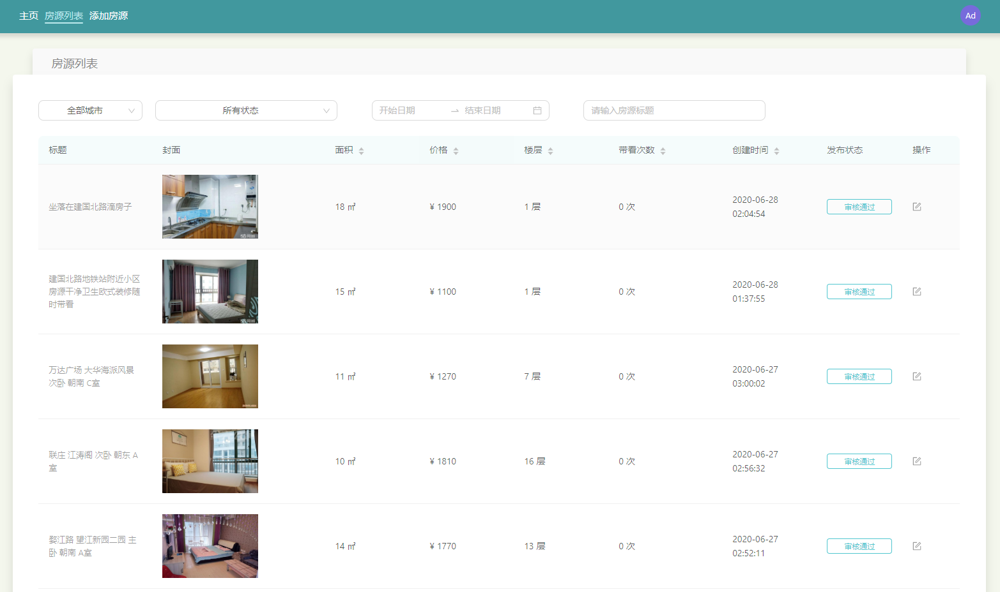
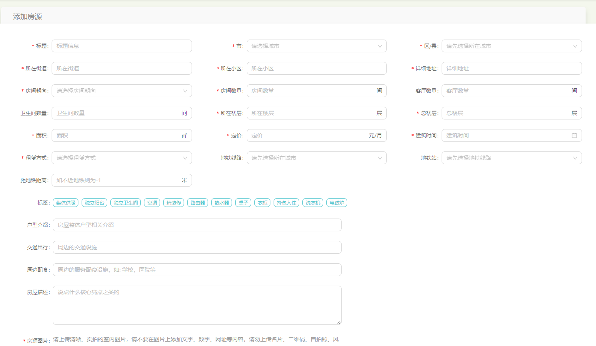
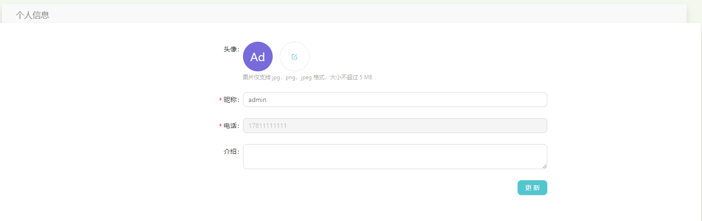

## 扫码加微信(微信号: 17879502601) 备注: rent-house 一起讨论技术

# **项目介绍**
Rent-house是一个前后端分离的高仿自如租房系统， 项目采用SrpingBoot+React开发， 项目中使用了常见的企业级应用所设计的技术的，例如: elasticsearch, redis, kafka等等
## 主要实现如下功能:
1. 管理端: 房源CRUD
2. 用户端: 地铁/区域/距离找房，地图找房， 区间价格找房，在线看房，VR看房等。
3. 管理员与用户实时聊天
4. 预约看房

### 后端技术栈: 
1. Spring Boot
2. Spring Security 
3. Spring Data Jpa 
4. Spring Data Elasticsearch 
5. Kafka 
6. Hadoop + Spark 
7. Redis
8. Elasticsearch
9. Kibana
10. Mysql
### 前端技术栈
1. React (HOOK)
2. React-Router
3. Redux
4. Antd4.x
5. Axios
6. Typescript
7. ....
# 已实现功能预览

## [在线体验地址](http://house.touchfish.top/client/home)

### 用户首页

## 房源详细

## 登录注册

### 管理员界面

### 新增房源界面

### 个人信息界面

### [前端源码点这里（代码在dev分支下）](https://github.com/night-233/rent-house-admin)
